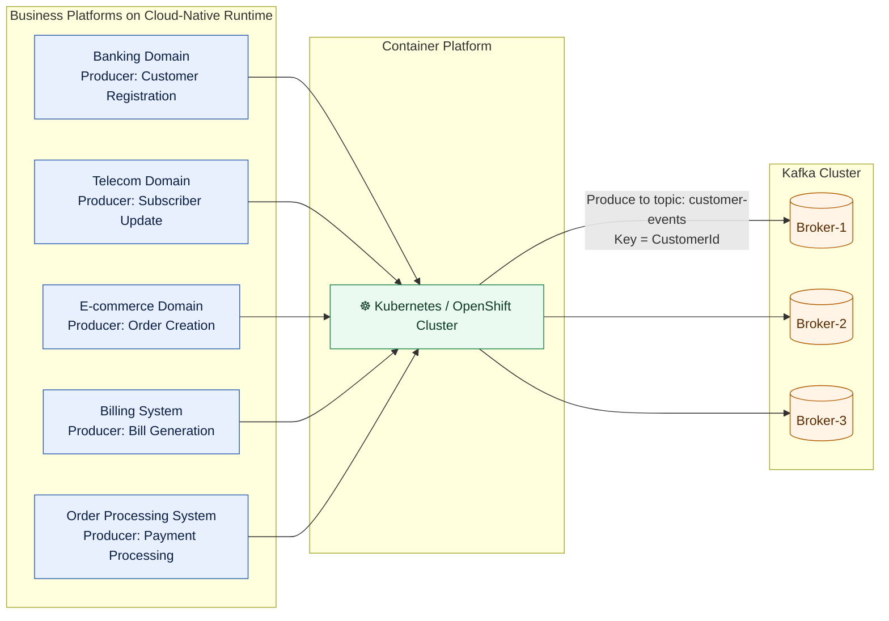
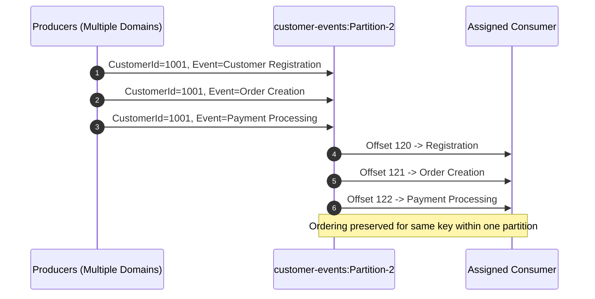
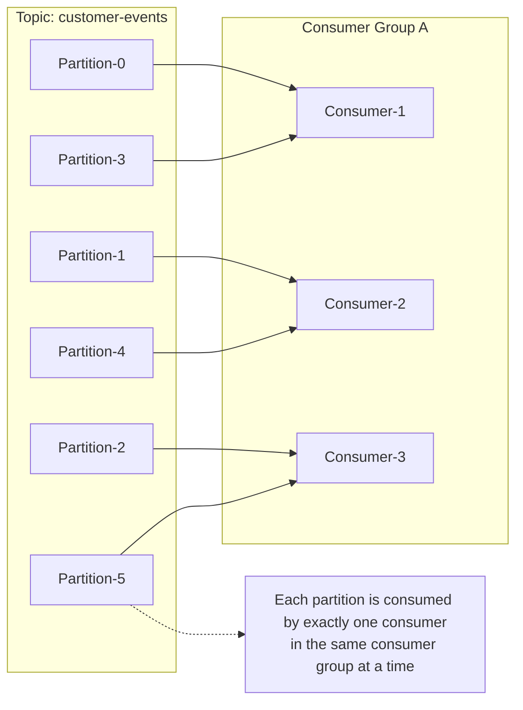

# Kafka Customer-Based Partitioning and Ordered Event Processing Architecture

## 1) Enterprise Context (Cloud-Native Domains -> Kafka)



## 2) Partitioning Strategy (Keyed by Customer ID)

**Kafka routing rule:**

```text
Partition = hash(CustomerId) % NumberOfPartitions
```

**Topic:** `customer-events`  
**Partitions:** `Partition-0` to `Partition-5` (6 total)

```mermaid
flowchart LR
  P1[Customer Registration\nCustomerId=1001]
  P2[Order Creation\nCustomerId=1001]
  P3[Payment Processing\nCustomerId=1001]
  P4[Bill Generation\nCustomerId=2001]

  H1[Kafka Producer Partitioner\nPartition = hash(CustomerId) % 6]

  subgraph T[Topic: customer-events]
    Q0[Partition-0]
    Q1[Partition-1]
    Q2[Partition-2]
    Q3[Partition-3]
    Q4[Partition-4]
    Q5[Partition-5]
  end

  P1 --> H1
  P2 --> H1
  P3 --> H1
  P4 --> H1

  H1 -->|CustomerId=1001 -> Partition-2| Q2
  H1 -->|CustomerId=1001 -> Partition-2| Q2
  H1 -->|CustomerId=1001 -> Partition-2| Q2
  H1 -->|CustomerId=2001 -> Partition-4| Q4
```

## 3) Ordering Guarantee Inside a Partition



## 4) Consumer Group Architecture and Partition Assignment



## 5) Event Types Produced by Domains

| Business Domain | Producer Event |
|---|---|
| Banking | Customer Registration |
| Telecom (Subscriber Management) | Subscriber Update |
| E-commerce | Order Creation |
| Billing System | Bill Generation |
| Order Processing System | Payment Processing |

## 6) Design Benefits

- **Message Ordering Guaranteed**: events for the same `CustomerId` are strictly ordered per partition.
- **Horizontal Scalability**: add partitions and consumers to increase parallel processing.
- **High Throughput**: workload is distributed across multiple brokers and partitions.
- **Fault Tolerance**: Kafka replication and consumer group rebalancing support resilience.
- **Customer Data Consistency**: key-based routing avoids cross-partition reordering for a customer timeline.

## 7) Architecture Notes for Review Boards

- Use `CustomerId` as mandatory message key in every producer API contract.
- Keep partition count fixed for stable key distribution; change only with migration planning.
- Use schema registry and versioned event contracts for enterprise governance.
- Monitor partition skew and consumer lag; rebalance producer keys if hotspots appear.
- Deploy producers/consumers as stateless pods on Kubernetes/OpenShift for elastic scaling.

